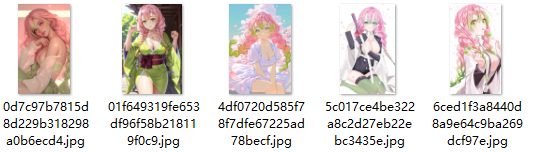

开发一个相册管理软件，需求如下

- 有整洁的主界面按网格分布所有相册，可以根据创作者筛选，也可以根据各类常见排序规则自动排序
- 有创作者标签页，可以自由编辑创作者相关信息
- 点击创作者标签可以看到对应的全部相册页面
- 将导入的文件夹自动按照设定的规则整理：~/创作者/相册xx
- 导入时可以将多个相册（文件夹）指定为某一个创作者批量整理
  - 可以批量编辑相册内的图片文件名编号
  - 如果文件夹内有非图片文件也可以按文件类型进行重命名编号
- 可以指定每个相册的封面图（如未指定默认为文件夹内的第一张图）
- 打开相册界面可以看到整个相册文件夹内的缩略图
  - 相册内如果有视频文件直接调用系统默认播放器打开
  - 相册内的视频文件也显示缩略图（如果做得到的话）
  - 我不清楚图片查看功能的制作成本如何，如果不难做就直接在应用内实现可以直接点开图片大图和翻页，如果比较复杂就点击图片用系统默认图片查看软件打开
- 做一个网址收藏页，可以自己记录一些图片网址
- 先做一个预览网页给我看一下效果，我确认再按后续方案开发
- 项目不是网页端的，是一个**纯本地**应用程序，技术选型向我提问来选择

---

后续调整：

- 调整ui，不要用默认Windows风格的提示窗、应用边框，用比较现代简约风格的独立ui
- 导入时应用有明显卡顿（程序短暂未响应，之后恢复）查找可能的原因并进行优化（或许可以加入进度条）
- 导入时不要强制指定创作者，无创作者的图库统一整理至“无创作者目录”或不整理
- 加入导入仅添加功能：不移动文件仅在图库中创建导入对象
- 加入创作者信息编辑功能，创作者不要用圆形头像，也用方形大缩略图

---

- 点开相册时也有明显卡顿
- 所有的删除加入提示，可以勾选仅删除程序内索引或者删除源文件
- 创作者也要有自定义缩略图头像
- 图片缩略图底下不要显示文件名，或者在缩略图下方另开一行显示，不要占据整个缩略图的方块；不要严格按照方块切割，而是按照原图比例显示
- 先加入点击缩略图直接调用系统当前默认的图像查看器打开图片的功能
- 相册封面预览就只要封面图，不要添加这种额外的元素
- 设置加入调整相册、创作者、图片缩略图大小的滑块，可以随拉动实时看到调整效果

---

- 这里的按键显示不完整
- 我的意思是缩略图预览做成类似原版Windows大缩略图的风格，文件名不要写在格子里面。放在缩略图片下面一行显示文件名、一行显示图片容量
- 上次修改中我提出的封面图预览去除额外元素，你把所有元素都删除了，但是原本那个显示图片数的元素还可以，把它加回来
- 给图片、相册加入右键菜单，可以单独重命名或者删除或查看图片属性
- 相册加入编辑页面，用于指定封面图、修改创作者（可选择同步移动文件）、向相册添加图片等功能
- 应用内图片查看器（大图 + 翻页），可在设置切换应用内查看还是用系统默认软件

以上调整完成后继续以下优化

- 视频缩略图生成（需要 FFmpeg）
- 真实的缩略图缓存（当前直接加载原图，大图片会慢）
